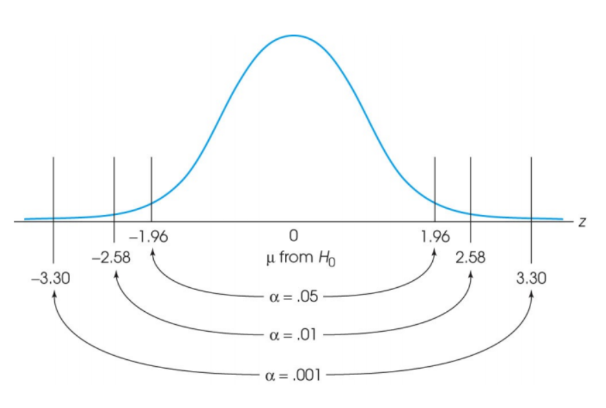
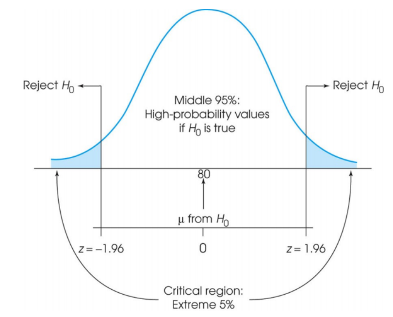

```{r setup, include=FALSE}
knitr::opts_chunk$set(echo = TRUE)
```

## 有关推论统计(Inference Statistics)

让我们这节课的讲义从推论统计开始讲起。在前面几节课的学习中，我们已经知道了Z分数(Z Score),概率密度函数(Probability Density Function,PDF)以及累计密度函数(Cumulative Density Function,CDF)以及正态分布(Gaussian/Normal Distribution),其让我们对一个变量的分布有了一定的了解。\

### 为什么我们需要推论统计

但，我们更加关心的事情是，我们想知道某件事情或处理(treatment)对分布的影响，比如看一个学习方法对提高学习成绩是否有作用。这件事情看起来很容易，你直接看总体前后的分数变化不久可以了？但这个过程需要人力物力投入，所以我们需要做的事情是，从样本(局部)中推断总体。\
其主要包括两种统计，其一是假设检验(Hypothesis Testing)，其二是参数估计(Estimating)。\

-   假设检验做的事情是**对某种假设进行检验，根据结果推断所做的假设是否可以接受(如均值是否发生改变)**
-   参数估计做的事情是**借助抽样对总体的数字特征进行估计(如均值、置信区间等)**

## 假设检验(图片文字部分来源Lecture6 PPT)

1.  假设检验做了什么：假设检验想看的事情是，**排除掉抽样误差后，一个处理(treatment)是否对总体当中的某个值发生了改变**\
2.  假设检验的对象：

-   样本从总体中选择出来
-   某个处理施加给此样本
-   检验此样本某统计量是否和总体(或样本)有差异

3.  假设检验的类型及适用条件(大家之后可以根据这个对不同检验类型加以整理)

**Z检验**：适用于**总体标准差已知**或(样本量较大，在这学期里不会涉及样本量的问题)

-   z检验的检验对象：均值是不是$\mu_0$;
-   z检验的默认前提：样本来自正态分布的总体，标准差$\sigma$是已知的;
-   样本均值分布：H0成立的条件下，M服从均值是$\mu_0$,标准差为$\frac{\sigma}{\sqrt{n}}$的正态分布;

**t检验**：适用于**总体标准差未知**的情况(当然t检验也有很多类型，之后课上会不断学到)\
**方差分析**：适用于处理条件较多的情形(也有很多类型，在本学期后半学期会学到)\

### Z检验(顺带介绍假设检验的步骤，手算)\
(1) 设置虚无假设以及备择假设：一般来说通常采用比较"保守"的假设。当然，这里的"保守"和我们关心的问题有关，比如我们关心的问题是，早八上机对学生提高心统成绩是否有益，这里我们应该保持"谦逊"的态度，因此H0是"早八上机对学生提高心统成绩没有帮助"\

(2) 设置显著性水平$\alpha$: $\alpha$反映了有多大可能性差异来自抽样误差(sampling error)\

(3) 确定拒绝域：通过设置显著性水平$\alpha$，我们可以确定好确定的z值范围，如果在这个z值之外，我们可以拒绝虚无假设(注意：我们确定拒绝域时需要判断检验的类型是双尾还是单尾，一般来说，单尾检验适用于**小于等于** **大于等于**这样的字样，双尾检验适用于**没有差异**这样的字眼)\



思考题：判断下列虚无假设时，使用双尾检验还是单尾检验 ：\
a. H0: 学钢琴的孩子智商不低于儿童智商的平均水平\
b. H0: 饭后喝白开水对老年人的血糖没有影响\
c. H0: 不去上心统课的同学和上心统课同学的期中成绩没有显著性差异\
d. H0: 美国成年人的平均身高不低于中国成年人的平均身高\

(4) 计算统计量(Z 检验中就是Z score，看看其和拒绝域之间的关系) 注意：在z检验中，我们计算样本均值的z分数，$z = \frac{\bar X - \mu_{0}}{\sigma/\sqrt{n}}$,得到的是，**样本均值相对总体均值的Z 分数**，随后根据此Z分数和拒绝域之间的关系进行判断。\

(5) 针对具体统计量进行判断：在进行判断虚无假设是否成立时，我们有两种方法进行判断，下面分别介绍如下(以双侧检验为例)：
- 拒绝域法：在(3)步求得了拒绝域$(-\infty,Z_{\alpha/2})和(Z_{1-\alpha/2},+\infty)$,如果样本均值对应的Z值落在了拒绝域内，我们认为可以拒绝虚无假设H0，接受备择假设
- p值法(更常用)：在(4)中计算得到了Z值后(假设Z大于0，小于0同理)，可以计算$Pr(|Z'| \geq Z)$,如果此值小于显著性水平$\alpha$，说明很小的可能性这个值是取样误差带来的，更有可能的确存在了差异\
思考：单侧检验的p值如何计算？\

所以对于Z检验我们要做的就是：**根据样本均值分布的均值和标准误计算得到Z，和拒绝域的Z去比较(或者计算p值，这个方法更推荐)，然后判断是否能够拒绝虚无假设**\

r语言Z分布计算p值的示例如下：
```{r}
Z <- 1.98
pnorm(-Z)+pnorm(Z,lower.tail = FALSE)

```
下面让我们来看作业的实例：
HW5 操作题1\
米隆临床多轴量表（MCMI-III）是对人格障碍进行评估的心理学量表，其包含回避型人格障碍的子量表(下文简称为Avoidant），关于这个量表我们知道以下信息：

- 每个人在Avoidant量表上的得分介于0到100之间;
- 假设我国人群总体Avoidant得分服从**均值为60**，**标准差为10**的正态分布。
- 在Avoidant分量表上得分超过70分，认为受测者可能存在相应人格问题
- 在Avoidant分量表上得分超过80分，则认为受测者大概率存在相应人格问题。

假设在我国人群总体小张收集了25名自称“社恐”的大学生在Avoidant量表上的得分，记录在"hw5.Rdata"中的"Av"变量中，请根据以上信息完成以下题目：

```{r 读取数据}
# load('hw5.Rdata')  #读取数据文件大家需要掌握
Av <- c(58,57,51,76,55,58,55,63,65,69,64,67,67,62,51,74,73,54,59,57,66,74,69,78,66)

```

#### 双侧检验示例
(1)、小张关心的研究问题是：自称“社恐”的大学生Avoidant的得分是否和人群总体有差异。请你帮他补全以下准备工作:\
- 虚无假设(3')：自称“社恐”的大学生Avoidant得分和总人群没有差异
- 备择假设(3')：自称“社恐"的大学生Avoidant得分和总人群存在差异
- 选择的显著性水平(2')：$\alpha$=0.05
- 检验的方向(单or双尾,2')：双尾

(2) 如果虚无假设成立，25名“社恐”大学生Avoidant得分具有怎样的样本均值分布(5')，计算相应的z分数(5');
```{r}
# 总体参数
mu <- 60
sigma <- 10

# 样本的均值分布
n <- 25
mu1 <- mu
se <- sigma/sqrt(n)

m <- mean(Av)
(z <- (m-mu1)/se)
```

(3) 根据(1)中的假设写出拒绝域并与(2)中计算的z分数进行比较，报告假设检验的结果;
```{r 拒绝域法}
# 由于是双侧检验，拒绝域应该有两边
alpha <- 0.05
(qnorm(alpha/2))    # 左侧拒绝域右端点
(qnorm(1-alpha/2))  # 右侧拒绝域左端点
```
所以拒绝域为(-inf,-1.96)和(1.96,inf),因为z=1.76并未落入拒绝域内，所以接受虚无假设

(4) 使用R的代码计算(3)z分数的p值(5')，根据p值报告假设检验的结果(5')，和上问使用拒绝域得到的结论是否一致;
```{r p值法}
(p <- 2*(1-pnorm(z)))
(p1 <- pnorm(-z)+pnorm(z,lower.tail = FALSE))
p > alpha
```

### 单侧检验实例
(5) 小丽更关心的研究问题是: 自称“社恐”的大学生Avoidant是否高于人群总体，请你帮她完成假设检验的过程(提示，参考前面4问的过程完整的报告假设检验的过程，选择拒绝域或者p值的方法选择一个即可，10');
- 虚无假设(3')：自称“社恐”的大学生Avoidant得分不高于(或者说小于等于)人群总体
- 备择假设(3')：自称“社恐"的大学生Avoidant得分高于人群总体
- 选择的显著性水平(2')：$\alpha$=0.05
- 检验的方向(单or双尾,2')：单尾

```{r}
# 拒绝域
(qnorm(1-alpha))
(qnorm(1-alpha) < z) # 单侧检验,拒绝域在Z分布的右侧，落入拒绝域内，说明拒绝虚无假设

# p值
(1-pnorm(z) < alpha)

```

###  效应量(Effect size)的测量\
为什么需要引入效应量呢？我们来看样本Z值的计算式：，$z = \frac{\bar X - \mu}{\sigma/\sqrt{n}}$，分子我们称之为处理效应(翻译实在不知道叫啥了，英文就是treatment effect)，分子这一部分是和样本量n相关的。所以样本量很大，这个Z值越有可能大，更有可能落在拒绝域里(所以你发现实验结果不显著，多补点被试试试！)，但即使有效应，我们也想知道这个效应到底有多大。这里就引入了Effect size，常常利用Cohen d来进行计算，计算公式如下：\
$$cohen's\ d = \frac{\bar X - \mu}{\sigma}$$
有人就会说了，哎呀为什么步直接用分析来做效应量呢？其实这里也就是考虑了总体的变异性，总体标准差很大，抽样得到的$\bar X$更大可能性比较大，所以分子除以了一个$\sigma$可以理解成进行leave out总体变异性的影响。但不管怎么样，可以看做是effect size的一种度量。\

(6) 报告本研究的效应量Cohen's d(6');
```{r effect size}
m <- mean(Av)
(cohen_d <- (m-mu)/sigma)
```

### 有关功效(Power)的分析(Power analysis)\
思考题准确来说是回顾题：什么是一类错误？什么是二类错误？\
功效可以认为是说，我们不犯二类错误的概率(即正确拒绝的概率)，也就是$1-\beta$，通过下方的图可能更加清晰：
```{r 双侧power示意图绘制}
sigma = 1
mu0 = 0
mu1 = 1
alpha = 0.05
x = seq(-3,3,by = 0.01)
plot(x, dnorm(x,mu0,sigma), 'l',ylab = 'density')
lines(x, dnorm(x, mu1, sigma), col ='blue')
lambda = qnorm(0.975)
seg = c(seq(-3,-lambda, by = 0.02), seq(lambda, 3, 0.02))
abline(v = c(-lambda, lambda),col = 'grey', lwd = 2)
segments(seg, 0, seg, dnorm(seg, mu0, sigma), col = 'red')  #第一类错误
segments(seg, 0, seg, dnorm(seg, mu1, sigma), col = 'green') #power

```

在上方图中，假设黑色分布是我们原来的分布，蓝色是最终处理好的分布，灰线是拒绝域端点。假设H1成立，那么我们正确拒绝的面积包含了两部分，左侧比较小部分的绿色和右侧比较大部分的绿色。所以我们直接计算两部分面积即可(想想如果是单侧检验的power面积在哪里,可以参考上面的代码绘制一下单侧检验power表示是哪一部分面积，答案在下方，点击177行小三角即可)
```{r your try}

```

但是需要注意的事情是，Power并不是针对某个人某个实验而谈的，它针对的对象是确定效应后，选择方向和显著性水平后，一类检验的效力。

```{r 单侧power示意图绘制}
sigma = 1
mu0 = 0
mu1 = 1
alpha = 0.05
x = seq(-3,3,by = 0.01)
plot(x, dnorm(x,mu0,sigma), 'l',ylab = 'density')
lines(x, dnorm(x, mu1, sigma), col ='blue')
lambda = qnorm(1-alpha)
seg = c(seq(lambda, 3, 0.02))
abline(v = c(lambda),col = 'grey', lwd = 2)
segments(seg, 0, seg, dnorm(seg, mu0, sigma), col = 'red')  #第一类错误
segments(seg, 0, seg, dnorm(seg, mu1, sigma), col = 'green') #power

```

### 结合power和效应量\
请看作业的最后一问：如果实际的效应量和前面算得Cohen's d一致, 请分别计算小张和小丽实验各自的检验效力。\
这个题目是啥意思呢？啥叫效应量和前面算得的Cohen's d一致，我们来想想cohen's d如何计算：$cohen's\ d = \frac{\bar X - \mu}{\sigma}$；它反应的是，我们总体的均值被做了何种牵引，如果真实效应量也是d的话，那么真实总体分布的均值是$\mu_1 = \mu_0+d*\sigma$，不过要注意的是，在Z test中，我们衡量效力的时候，采用的分布标准差是**标准误差**，H0是均值为$\mu_0,标准差为se$的正态分布，H1对应的分布是均值为$\mu_1,标准差为se$的正态分布。

```{r 看图说话}
# 小张
# 原参数：
mu0 <- 60
sigma <- 10
n <- 25
se <- sigma/sqrt(n)

# 我们先求H1对应分布的均值
mu1 <- mu0+cohen_d*sigma

# 接着来求H0对应的拒绝域
# 我们先求下z值，当然可以直接利用qnorm函数求，但是为了力求和ppt匹配，这里先求z
z_zhang_left <- qnorm(alpha/2)    # z_{\alpha/2}
z_zhang_right <- qnorm(1-alpha/2) # z_{1-\alpha/2}

# 接着我们来求具体值
c_zhang_left <- mu0+z_zhang_left*se    #一步到位：qnorm(alpha/2,mu0,se)
c_zhang_right <- mu0+z_zhang_right*se  #一步到位：qnorm(1-alpha/2,mu0,se)

# 利用分布来求面积
# H1对应的分布 N(mu1,se)
# 注意有两部分面积，虽然ppt上给约等于，但是如果遇到effect size不那么大的时候，可能还会比较小，所以建议算上两边
left_area <- pnorm(c_zhang_left,mu1,se)
right_area <- 1-pnorm(c_zhang_right,mu1,se)
(left_area+right_area)
```

小丽是单侧检验，可当做思考题，答案在下面,可先运行下面单侧检验图来求解(看图说话)：
```{r 单侧power示意图}
sigma = 1
mu0 = 0
mu1 = 1
alpha = 0.05
x = seq(-3,3,by = 0.01)
plot(x, dnorm(x,mu0,sigma), 'l',ylab = 'density')
lines(x, dnorm(x, mu1, sigma), col ='blue')
lambda = qnorm(1-alpha)
seg = c(seq(lambda, 3, 0.02))
abline(v = c(lambda),col = 'grey', lwd = 2)
segments(seg, 0, seg, dnorm(seg, mu0, sigma), col = 'red')  #第一类错误
segments(seg, 0, seg, dnorm(seg, mu1, sigma), col = 'green') #power

```

```{r 小丽}
# 小丽
# 原参数：
mu0 <- 60
sigma <- 10
n <- 25
se <- sigma/sqrt(n)

mu2 <- mu0+cohen_d*sigma
c_li <- qnorm(1-alpha,mu0,se)
1-pnorm(c_li,mu2,se)

```

### Z检验调包
```{r z.test函数 进行z检验}
library(BSDA)
x <- Av
z.test(x, #放入我们的样本
       alternative = 'g', #检验方向'two.sided','greater','less'
       mu = 60, #mu0
       sigma.x = 10, #sigma
       conf.level = 0.95 #1 - alpha level
       )
#stats包没有专门进行z检验的函数，可见这个检验不是很常见
#主要就是个承上（样本均值分布，概率）启下（假设检验）的东西吧
#未来这门课程的学习：从自己按照原理算到调用函数
#在实际的心理学研究中，p值比拒绝域方法更常用
```

```{r power计算}
#install.packages('pwr')
library(pwr)
##从理论上，给定检验类型（z检验，t检验等等）和方向性（双尾，大于，小于）
##效应量d，样本量n，显著性水平alpha，检验力power四个值已知任意三个都是可以计算的
##pwr做的事情就是给定其中三个值，自动补全空缺的第四个值
##我个人理解，我们一般只做计算power和估计所需样本量两件事

#我们以z检验为例，使用pwr.norm.test函数

#（1常用）已知d，n，alpha，计算检验力power
pwr.norm.test(d= 0.352, n=25, sig.level=0.05, alternative = 't')

#（2常用）已知d，n，power，计算最少样本量n
pwr.norm.test(d=2/3, power=0.8, sig.level=0.05, alternative = 'g')

#（3一般）已知d，n，power，计算alpha（没想到有啥用）
pwr.norm.test(d=2/3, n=10, power=0.8, sig.level = NULL, alternative = 'g')
#（4一般）已知alpha，n，power，计算效应量d（没想到有啥用）
pwr.norm.test(d= NULL, n=10, power= 0.8, sig.level =0.05, alternative = 'g')
```

思考：采用pwr包计算hw5中小丽的power
```{r}

```


### t检验
在上述Z检验的描述中，我们需要的前提假设是**总体标准差已知**，但是有时候，总体标准差是未知的，这个时候我们没法直接转化为Z值去进行比较。那么有没有一种方法，可以便于我们进行比较呢，答案是存在的，我们可以利用“t分布”来进行比较。

#### t分布
t分布的公式可能稍稍有点复杂，大家可以自行bing搜索一下，但是其也有一些有意思的特征：
(1)其一，t分布和标准正态分布类似，都是关于均值0对称的单峰图像
(2)其二，t分布与其自由度(df)有关，df越大，t分布越接近正态分布，df越小，图像越扁平

```{r PDF figure}
xtick <- seq(-5, 5, 0.01)
PDF = dnorm(xtick)
plot(xtick, PDF, 'l', lwd = 3, main = 'z and t score')
lines(xtick, dt(xtick, df = 1), col = 'blue')
lines(xtick, dt(xtick, df = 3), col = 'gold')
lines(xtick, dt(xtick, df = 100), col = 'red')
legend('topright', c('normal', 't df = 1', 't df = 3', 't df = 100'),
       fill = c('black', 'blue', 'gold','red'))
```

```{r CDF figure}
#思考：t分布和z分布CDF图像的差异是怎样的呢？
xtick <- seq(-5, 5, 0.01)
CDF = pnorm(xtick)
plot(xtick, CDF, 'l', lwd = 3, main = 'z and t score')
lines(xtick, pt(xtick, df = 1), col = 'blue')
lines(xtick, pt(xtick, df = 3), col = 'gold')
lines(xtick, pt(xtick, df = 100), col = 'red')
legend('topright', c('normal', 't df = 1', 't df = 3', 't df = 100'),
       fill = c('black', 'blue', 'gold','red'))
```

#### t检验
在我们期中考试之前，用到的t检验聚焦于**一组样本均值和一个固定值，但标准差未知**的比较\
如服用药物的患者和120是否有差异，思考一下和Z检验的差异，如果是Z检验，我们除了需要知道120之外，我们还要知道人群总体血压的标准差，但是在这个例子中，我们并不知道这个sd，我们用样本标准差近似替代。此时不能再进行Z检验，我们需要使用t test。有关one sample t test如何进行，请下一位助教讲解hw6_guide.rmd。\

注：区分Z test和one sample t test\

- Z test:总体均值和标准差都已知，利用样本均值的Z分数判断
- one sample t test：将样本均值和某具体值比较，但是标准差未知，我们使用one sample t test(r 中有现成函数，参考hw6_guide)

