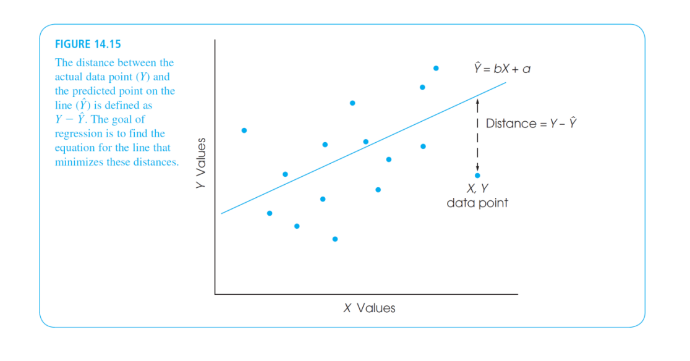
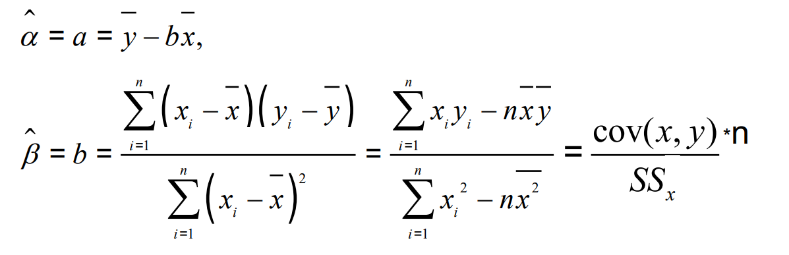
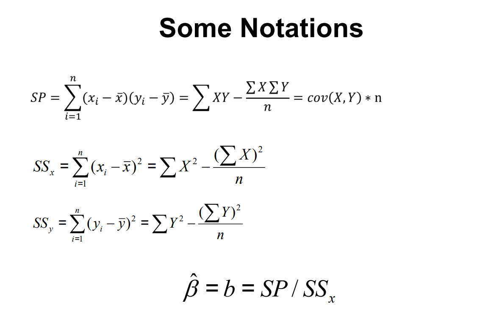
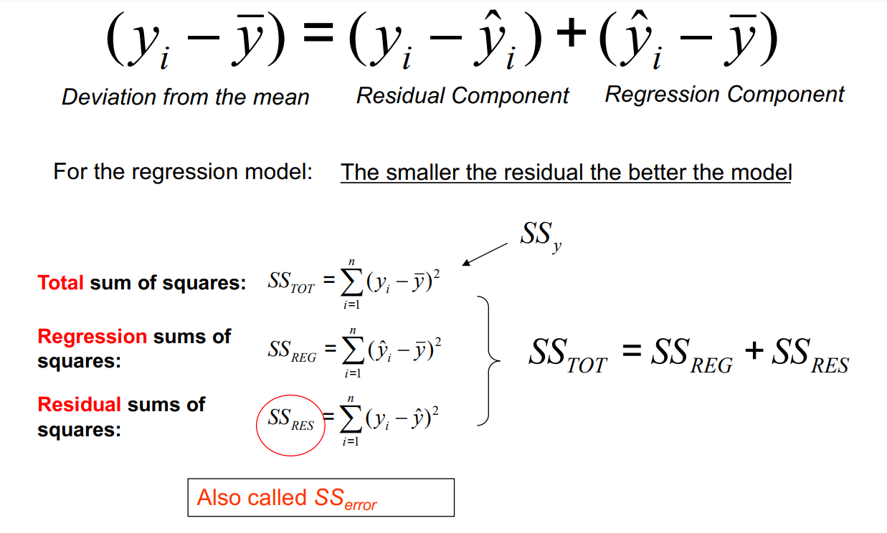

```{r setup, include=FALSE}
knitr::opts_chunk$set(echo = TRUE)
```

## 线性回归的数学原理

### 回归与相关

(1)线性关系与线性模型：变量之间的关系是一次函数关系的------图象是直线，叫做线性；所以线性模型可以写成$y = b_1*X_1+b_2*X_2+a,\space y = b*X+a$这种形式，其中自变量的个数叫做元数，我们课上提到的是一次函数，此类回归任务也叫**一元线性回归**。\

(2)**回归与相关并不局限于线性模型**：请注意我们上节课提到的皮尔逊相关也好，这节课提到的线性回归我们都是针对"线性模型"而言的。需要注意的是，相关和回归不止局限于线性关系和线性模型，假设两个或者多个元素之间呈多项式或者指数关系，我们仍然可以称之其为"相关"，同样也有相应方法对其进行拟合。

```{r 非线性相关例子}
# data generation
set.seed(1024)
x <- 1:8
y1 <- 2*x + rnorm(length(x),0,2) # linear 
y2 <- 3*(x-5)^2+3 #polynomial

par(mfrow=c(1,2))
plot(x,y1)
plot(x,y2)
```

### 有关线性回归的计算过程

这一点老师在课上可能提到的具体不是特别细致，从此门课的授课角度来说，这门课更希望大家掌握相关技巧的应用，而非是些更底层的数学原理。但是在笔者上这门课的时候(彼时我还大一)，感觉更多对于这些计算如何实现比较好奇，而上课却没有讲的特别多，秉持着"多学无害"的态度，在这里还是会和大家讲解一下具体的数学原理。考试的时候不会要求大家直接手推过程，只需要理解大致的思想以及解法即可。以下部分是对一元线性回归的理解：\

首先，线性回归目标是：构建一个直线方程$y = kx+b$使得这个线性模型可以预测数据，那么凭什么说这个model可以更好预测数据呢，理论就是这个model预测结果要和我们的训练数据最为贴近。那么如何说明我们的model的预测数据和训练数据是否贴近呢？\

在这里，$\hat{Y}$表示是model预测的值，Y代表每个数据点的Y值，二者的差值就可以看做是到预测到实际的距离了，但是你会发现这个值可正可负，如果对于每个点的预测距离我们直接相加可能导致这个值很接近0，换句话说，这个值不是越小越好(因为有负数，负数很小但是实际上这个距离差距还是挺大的)。为了更好去量化，这里我们的目标是最小化距离平方和，因为如果我们的model如果可以完美预测所有数据点，那么每个点的距离都是0，距离平方和也是0；如果距离有正有负，平方之后统一都是正值了，所以求和这个非负数越小代表预测效果越好。\


所以我们的目标为:找到一组a和b，使得$S = \sum_{i=1}^{n}(y_i-a-bx_i)^2$最小(S表示了每个点的距离平方和)\

好现在我们的目标是优化S，观察S你会发现意见事情，里面的x_i和y_i我们其实都已知(毕竟它们就是我们的数据点)，我们唯二不知道的是里面的a和b。大家这学期应该都学过多元函数，所以你会发现S其实是关于a和b的二元函数，对于这样一个二元函数，有一个求极值的方法，就是利用梯度(gradient)。梯度可以理解成函数对自变量的导数，表现在曲面上，应该是函数值变化的方向，如果两个方向都没有变化，那么这个点就可以认为是一个稳定点(又极值点)。因为这里有两个参数，所以S有关于a的梯度,也有关于b的梯度。所以利用S对a和b分别求导，并且令导数为0，便可以求出我们的a和b。注意，对于一元回归，如果你样本量足够多的话，这个a和b解是唯一的(其实解的数量与(样本量与模型参数量大小)有关，这一点与矩阵的秩有关，可以想想为什么，不会考察大家。比方说你只有一个样本点，但是你要拟合有两个参数的model，这玩意有无穷解，毕竟只要过这个点就可以了)\

因为我们给定一组数据，可以用这组数据点的数据直接给出模型的参数，这样的参数又叫闭式解(closed solution)或解析解，大家感兴趣的话，可以自行利用S对a和b分别求导，看看能不能推出这样的形式\


如果我们从方差的角度出发，定义如下，斜率b还可以写成：\
 在我们的作业中，给出了计算两个向量SS的方法，请让大家使用已定义好的函数计算这里的闭式解beta，大家之后可以去尝试一下。

### 拟合效果的再分析

前面我们说到，在线性拟合的时候我们的目标是最小化预测点和实际点之间的距离，然后因为存在正负可能没法直接相加，我们直接去优化距离平方和。不过现在我们想看一下这个线性模型解释力如何(即Y的变异性有多少可用被xy之间的线性关系所解释)，所以我们还采用方差分析的视角来看待：至于为什么$SS_{TOT} = SS_{REG}+SS_{REG}$，大家可以看知乎上的这篇文章：<https://zhuanlan.zhihu.com/p/367482693> 

$SS_{TOT}$可以看做是数据中全部的变异性，其有两部分构成，一部分是线性关系的方差$SS_{REG}$，一部分是无法被线性关系解释的方差$SS_{RES}$，我们其实想看的是$SS_{REG}$在其中的占比，这个比值也就是我们所说的$r^2$。同时我们也可以利用$SS_{RES}$和$SS_{RES}$以及其相应的自由度来计算F值，对此线性模型显著性进行检验。

而值得说明的是，在上节课中我们同样提到了点二列相关的显著性检验，大家可以对比这两种检验的方式，看看点二列相关显著性检验和线性回归显著性检验有什么相似之处？(这一点也在我们的作业中有一道题目的选项有所体现)

## 线性回归的R语言实现

参考网站：<https://blog.csdn.net/gavin_cdc/article/details/94659506>

### 数据生成

```{r}
set.seed(2023)
x1 <- rnorm(24,10,2)
x2 <- rnorm(24,5,0.4)
y <- 2*x1+3*x2
example_data <- data.frame(x1 = x1,x2 = x2,y=y)
```

#### 散点图绘制

在正式回归分析前，大家请注意数据之间不一定是线性关系，所以一个小建议是在回归模型拟合前，先去大概画一下不同变量之间关系的散点图，大概看看彼此之间长什么样子，如果像上面那种二次函数的关系显然不适合现象回归。由于我们本课程要求做一元回归，这里直接画两个变量之间的散点图。

```{r scatter plot}
plot(x1,y,col='blue',main = 'Relationship between y and x1')
```

发现结果其实还行，接下来我们可以进行线性回归

#### 拟合模型

接下来我们去定义线性模型，请注意在线性模型中我们可以去做多元回归，在下面的例子中，注释部分是多元回归，具体方程形式给大家写在了后面，大家只需要掌握最简单的一元线性回归即可。请注意在指定线性模型时，最好传入dataframe，然后指定列之间回归。

```{r linear model}
# 一元线性模型
model1 <- lm(y~x1,data = example_data) #拟合的model：y = b*x_1+a

# 多元线性模型不含交互
# model2 <- lm(y~x1+x2,data = example_data)  #拟合的model: y = b_1*x_1+b_2*x_2+a

# 多元线性模型含交互
# model2 <- lm(y~x1+x2+x1:x2,data = example_data)  #拟合的model: y = b_1*x_1+b_2*x_2+b_3*x_1*x_2

```

```{r check the results}
summary(model1)
```

#### 拟合的模型的可视化

```{r line plot}
# draw the scatter and line plot
plot(x1,y,col = "blue",main = "Relationship between y and x1",
abline(lm(y~x1)),cex = 1.3,pch = 16,xlab = "x1",ylab = "y")

```

#### 有关模型拟合的提取

对于拟合好的model，如上面的model1，其会有不同的参数，比如残差、系数、以及其他等等。大家可以根据需要自行提取。

```{r}
(model1$coefficients) #系数，k和b
(model1$residuals)    #残差
plot(model1)          #生成评价拟合模型的诊断图
```

#### 有关预测

其实拟合线性模型一个很重要的作用在于，帮助我们更好进行预测，我们可以通过已经有的模型对未知的数据进行预测，下面是相对应的写法

```{r}
# fitted predicted data
(predict(model1))

# 或者
model1$fitted.values
```

```{r 根据新数据进行预测}
# set the dataframe to be predicted,please notice the column name should be the same with the linear model
data <- data.frame(x1 = c(2.5))

# prediction
predict(model1,newdata = data)
```
